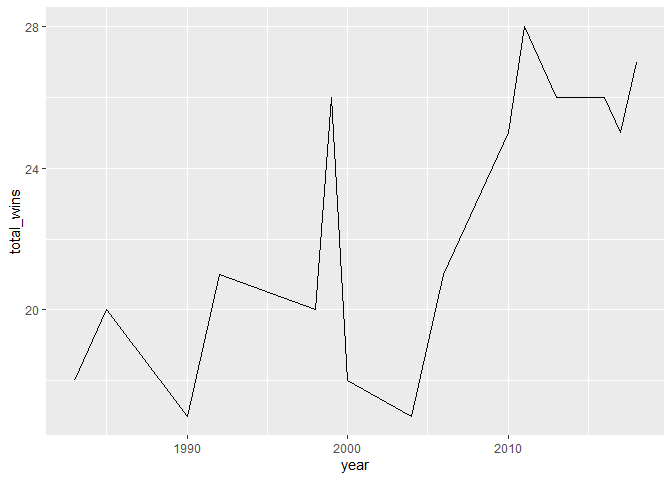

Mini Data-Analysis: Deliverable 1
================

Total points available: 74

# Part 0: Getting Set Up

Let’s get ready to work on this assignment!

**0.1: Install Packages**

- Install the [`diversedata`](https://diverse-data-hub.github.io/)
  package by typing the following into your **R console**:

<!-- -->

    install.packages("pak")
    library(pak)
    pak::pak("diverse-data-hub/diversedata")

If you’re having trouble with installation, you may not have `Rtools`
installed yet. Try the following instructions (Windows):

- Close RStudio

- Download the specific version of Rtools that matches your version of R
  (for example, Rtools44 for R 4.4, or Rtools45 for newer versions) from
  the [CRAN Rtools
  page](https://cran.r-project.org/bin/windows/Rtools/). Follow the
  instructions to install.

- In RStudio, run `Sys.which("make")` to see if RTools has been
  successfully installed.

- Run
  `install.packages("pak", repos = sprintf("https://r-lib.github.io/p/pak/stable/%s/%s/%s", .Platform$pkgType, R.Version()$os, R.Version()$arch))`

**0.2: Load Packages**

Typically, R Packages are loaded in at the very beginning of the
analysis. If you later want to use other packages, please come back and
add them here:

``` r
library(tidyverse)
library(diversedata)

#--- Add any other packages below this line ---#
```

# Task 1: Choose a Data Set and Research Question

The following data sets can be used for this project from
`diversedatahub`:

- **wildfire**: This data set contains information on wildfires in
  Canada, compiled from official government sources under the Open
  Government Licence – Alberta. The data was gathered to monitor,
  assess, and respond to wildfire risks across different regions.
  Wildfires have far-reaching environmental, social, and economic
  consequences. From an equity and inclusion perspective, analyzing
  wildfire data can reveal geographic and resource-based disparities in
  detection and containment efforts, and highlight how certain
  populations face greater risks due to climate change and limited
  infrastructure. There are 26551 rows and 35 columns.

- **genderassessment**: Collected in 2023, the data allows for
  comparative evaluation across countries, sectors, and ownership types
  (e.g., Public, Private, Government). Each record represents a company
  and its corresponding evaluation across 28 detailed gender related
  indicators, offering a comprehensive snapshot of corporate gender
  equity worldwide. There are 2000 rows and 29 variables

- **globalrights**: This data set provides yearly, country-level
  information on LGBTQ+ rights, economic indicators, and education
  spending from 2001 to 2023. It is compiled from Our World in Data,
  with primary sources including Equaldex, the World Bank, and other
  open-access data sets.The data enables cross-country and temporal
  comparisons of LGBTQ+ rights and economic/education metrics,
  exploration of relationships between rights and economic development,
  and identification of regional and temporal trends. There are 2125
  rows and 10 columns, with a lot of missing data.

- **hcmst**: This data set is adapted from the original data set [How
  Couples Meet and Stay Together 2017,
  2022](https://data.stanford.edu/hcmst2017). This study, led by
  researchers from Stanford University, surveyed 1,722 U.S. adults in
  2022 to explore how relationships form and change with time and
  focused on dating habits and the impact of the COVID-19 pandemic on
  relationships. This adapted data set focuses on variables that may
  affect the quality of the relationship, considering demographic
  characteristics of the subjects, couple dynamics, as well as
  COVID-19-related variables. The COVID-19 pandemic had a [significant
  impact](https://pmc.ncbi.nlm.nih.gov/articles/PMC10009005/) on
  romantic relationships in the United States. This data set enables
  exploration of how external factors, like the health of the subjects
  and changes in income, as well as personal behaviors, like conflict
  and intimate dynamics, relate to an individual’s perception of the
  quality of the relationship. There are 1328 rows and 21 columns.

- **womensmarchmadness**: This adapted data set contains historical
  records of every NCAA Division I Women’s Basketball Tournament
  appearance since the tournament began in 1982 up until 2018, capturing
  tournament results across more than four decades of collegiate women’s
  basketball. All data is sourced from the NCAA and contains the data
  behind the story [The Rise and Fall Of Women’s NCAA Tournament
  Dynasties](https://fivethirtyeight.com/features/louisiana-tech-was-the-uconn-of-the-80s/).
  The rise in popularity of the NCAA Women’s March Madness, fueled by
  athletes like Caitlin Clark and Paige Bueckers, reflects a broader
  cultural shift in the recognition of women’s sports. Beyond
  entertainment and athletic achievement, women’s participation in sport
  has social and professional benefits. There are 2092 rows and 20
  columns.

*Note: We encourage you to use the ones in the `diversedata` package,
but if you have a data set that you’d really like to use, please check
with a member of the teaching team to see whether the data set is of
appropriate complexity. If approved, please add a brief description of
the data here.*

### 1.1: Choose 2 data sets **(2 points)**

Out of the 5 data sets listed above, choose **2** that appeal to you
based on their description. Write your choices below:

<!-------------------------- Start your work below ---------------------------->

1: My first choice is wildfire dataset. I grew up in BC and am
interested in this data.

2: My second choice is womensmarchmadness

<!----------------------------------------------------------------------------->

### 1.2: Explore the Data **(12 points)**

One way to narrowing down your selection is to *explore* the data sets.
Use your knowledge of `dplyr` to summarize three variables in each of
the data sets (for example, listing what levels of a categorical
variable exist, or calculating the mean of a continuous variable of
interest). Write a sentence that describes your findings for each
variable explored. You may use multiple R code chunks if preferred.

<!-------------------------- Start your work below ---------------------------->

#### Data Set 1

``` r
### Explore 3 variables of data set 1 ###
head(wildfire)
```

    ## # A tibble: 6 × 35
    ##    year fire_number current_size size_class latitude longitude fire_origin    
    ##   <dbl> <chr>              <dbl> <chr>         <dbl>     <dbl> <chr>          
    ## 1  2006 PWF001              0.1  A              56.2     -117. Land Owner     
    ## 2  2006 EWF002              0.2  B              53.6     -116. Fire Department
    ## 3  2006 EWF001              0.5  B              53.6     -116. Fire Department
    ## 4  2006 EWF003              0.01 A              53.6     -116. Industry       
    ## 5  2006 PWF002              0.1  A              56.2     -117. Fire Department
    ## 6  2006 CWF001              0.2  B              51.2     -115. Fire Department
    ## # ℹ 28 more variables: general_cause <chr>, responsible_group <chr>,
    ## #   activity_class <chr>, true_cause <chr>, fire_start_date <dttm>,
    ## #   detection_agent_type <chr>, detection_agent <chr>,
    ## #   assessment_hectares <dbl>, fire_spread_rate <dbl>, fire_type <chr>,
    ## #   fire_position_on_slope <chr>, weather_conditions_over_fire <chr>,
    ## #   temperature <dbl>, relative_humidity <dbl>, wind_direction <chr>,
    ## #   wind_speed <dbl>, fuel_type <chr>, initial_action_by <chr>, …

``` r
#Exploring the mean start date of fire by year
fire_start_by_year <- wildfire %>% 
  group_by(year) %>%
  summarise(mean_start  = mean(fire_start_date, na.rm = TRUE))

head(fire_start_by_year)
```

    ## # A tibble: 6 × 2
    ##    year mean_start         
    ##   <dbl> <dttm>             
    ## 1  2006 2006-06-16 19:08:12
    ## 2  2007 2007-07-06 05:07:58
    ## 3  2008 2008-06-27 03:38:49
    ## 4  2009 2009-06-28 12:10:49
    ## 5  2010 2010-06-14 02:56:57
    ## 6  2011 2011-06-29 22:04:39

``` r
#Exploring levels of cateogorical variables - general cause, size class
levels(as.factor(wildfire$true_cause))
```

    ##  [1] "Abandoned Fire"         "Animals"                "Arson Known"           
    ##  [4] "Arson Suspected"        "Burning Substance"      "Flammable Fluids"      
    ##  [7] "Friction Spark"         "High Hazard"            "Hot Exhaust"           
    ## [10] "Incendiary Device"      "Insufficient Buffer"    "Insufficient Resources"
    ## [13] "Line Impact"            "Mechanical Failure"     "Permit Related"        
    ## [16] "Unattended Fire"        "Unclassified"           "Unknown"               
    ## [19] "Unpredictable Event"    "Unsafe Fire"            "Vehicle Fire"          
    ## [22] "Winter Burning"

``` r
levels(as.factor(wildfire$size_class))
```

    ## [1] "A" "B" "C" "D" "E"

I wanted to see what the average start time of fire season for each
year. It seems to start around a similar time point from 2006-2011.

I found there are 22 categories of general causes of the wildfires

There are 5 categories for size class

#### Data Set 2

``` r
### Explore 3 variables of data set 2 ###
head(womensmarchmadness)
```

    ## # A tibble: 6 × 20
    ##    year school     seed conference conf_wins conf_losses conf_wins_pct conf_rank
    ##   <dbl> <chr>     <dbl> <chr>          <dbl>       <dbl>         <dbl>     <dbl>
    ## 1  1982 Arizona …     4 Western C…        NA          NA          NA          NA
    ## 2  1982 Auburn        7 Southeast…        NA          NA          NA          NA
    ## 3  1982 Cheyney       2 Independe…        NA          NA          NA          NA
    ## 4  1982 Clemson       5 Atlantic …         6           3          66.7         4
    ## 5  1982 Drake         4 Missouri …        NA          NA          NA          NA
    ## 6  1982 East Car…     6 Independe…        NA          NA          NA          NA
    ## # ℹ 12 more variables: division <chr>, reg_wins <dbl>, reg_losses <dbl>,
    ## #   reg_wins_pct <dbl>, bid <chr>, first_game_at_home <chr>,
    ## #   tourney_wins <dbl>, tourney_losses <dbl>, tourney_finish <chr>,
    ## #   total_wins <dbl>, total_losses <dbl>, total_wins_pct <dbl>

``` r
#Exploring number of and options for different conferences
levels(as.factor(womensmarchmadness$conference))
```

    ##  [1] "America East"        "American Athletic"   "American Atletic"   
    ##  [4] "American South"      "ASUN"                "Atlantic"           
    ##  [7] "Atlantic-10"         "Atlantic 10"         "Atlantic Coast"     
    ## [10] "Atlantic Sun"        "Big 12"              "Big East"           
    ## [13] "Big Eight"           "Big Sky"             "Big South"          
    ## [16] "Big Ten"             "Big West"            "Colonial"           
    ## [19] "Colonial Athletic"   "Conference USA"      "Cosmopolitan"       
    ## [22] "East Coast"          "Great Midwest"       "Gulf Star"          
    ## [25] "High Country"        "Horizon"             "Independent"        
    ## [28] "Ivy"                 "Metro"               "Metro Atlantic"     
    ## [31] "Mid-American"        "Mid-Continent"       "Mid-Eastern"        
    ## [34] "Midwestern"          "Missouri Valley"     "Mountain West"      
    ## [37] "Mountain West Athl." "North Atlantic"      "North Star"         
    ## [40] "Northeast"           "Northern California" "Northern Pacific"   
    ## [43] "Ohio Valley"         "Pac-12"              "Pacific-10"         
    ## [46] "Pacific Coast"       "Pacific West"        "Patriot"            
    ## [49] "Southeastern"        "Southern"            "Southland"          
    ## [52] "Southwest"           "Southwestern"        "Summit"             
    ## [55] "Sun Belt"            "SWAC"                "Trans-America"      
    ## [58] "Trans America"       "West Coast"          "Western Athletic"   
    ## [61] "Western Atlantic"    "Western Collegiate"

``` r
#Exploring total number and different schools
levels(as.factor(womensmarchmadness$school))
```

    ##   [1] "Akron"                "Alabama"              "Alabama St."         
    ##   [4] "Albany"               "Alcorn St."           "American"            
    ##   [7] "Appalachian St."      "Arizona"              "Arizona St."         
    ##  [10] "Arkansas"             "Army"                 "Army West Point"     
    ##  [13] "Asheville"            "Auburn"               "Austin Peay"         
    ##  [16] "Ball St."             "Baylor"               "Belmont"             
    ##  [19] "Boise St."            "Boston College"       "Boston University"   
    ##  [22] "Bowling Green"        "Brown"                "Bucknell"            
    ##  [25] "Buffalo"              "Butler"               "BYU"                 
    ##  [28] "Cal Poly"             "Cal St. Fullerton"    "California"          
    ##  [31] "Campbell"             "Canisius"             "Central Arkansas"    
    ##  [34] "Central Mich."        "Charlotte"            "Chattanooga"         
    ##  [37] "Cheyney"              "Cincinnati"           "Clemson"             
    ##  [40] "Cleveland St."        "Colgate"              "Colorado"            
    ##  [43] "Colorado St."         "Coppin St."           "Cornell"             
    ##  [46] "Creighton"            "CSUN"                 "Dartmouth"           
    ##  [49] "Dayton"               "Delaware"             "Delaware St."        
    ##  [52] "Denver"               "DePaul"               "Detroit Mercy"       
    ##  [55] "Drake"                "Drexel"               "Duke"                
    ##  [58] "Duquesne"             "East Carolina"        "Eastern Ill."        
    ##  [61] "Eastern Ky."          "Eastern Mich."        "Eastern Wash."       
    ##  [64] "Elon"                 "ETSU"                 "Evansville"          
    ##  [67] "Fairfield"            "FGCU"                 "FIU"                 
    ##  [70] "Fla. Atlantic"        "Florida"              "Florida A&M"         
    ##  [73] "Florida St."          "Fordham"              "Fresno St."          
    ##  [76] "Furman"               "Ga. Southern"         "Gardner-Webb"        
    ##  [79] "George Washington"    "Georgetown"           "Georgia"             
    ##  [82] "Georgia St."          "Georgia Tech"         "Gonzaga"             
    ##  [85] "Grambling"            "Green Bay"            "Hampton"             
    ##  [88] "Hartford"             "Harvard"              "Hawaii"              
    ##  [91] "Holy Cross"           "Houston"              "Howard"              
    ##  [94] "Idaho"                "Idaho St."            "Illinois"            
    ##  [97] "Illinois St."         "Indiana"              "Iona"                
    ## [100] "Iowa"                 "Iowa St."             "Jackson St."         
    ## [103] "Jacksonville"         "James Madison"        "Kansas"              
    ## [106] "Kansas St."           "Kent St."             "Kentucky"            
    ## [109] "La Salle"             "La.-Monroe"           "Lamar"               
    ## [112] "Lehigh"               "Liberty"              "Lipscomb"            
    ## [115] "Little Rock"          "Long Beach St."       "Long Island"         
    ## [118] "Louisiana"            "Louisiana Tech"       "Louisville"          
    ## [121] "Loyola (MD)"          "Loyola Marymount"     "LSU"                 
    ## [124] "Maine"                "Manhattan"            "Marist"              
    ## [127] "Marquette"            "Marshall"             "Maryland"            
    ## [130] "Massachusetts"        "McNeese"              "Memphis"             
    ## [133] "Mercer"               "Miami (FL)"           "Miami (OH)"          
    ## [136] "Michigan"             "Michigan St."         "Middle Tenn."        
    ## [139] "Milwaukee"            "Minnesota"            "Mississippi St."     
    ## [142] "Missouri"             "Missouri St."         "Monmouth"            
    ## [145] "Montana"              "Montana St."          "Mt. St. Mary's"      
    ## [148] "Murray St."           "N.C. A&T"             "Navy"                
    ## [151] "NC A&T"               "NC State"             "Nebraska"            
    ## [154] "New Mexico"           "New Mexico St."       "New Orleans"         
    ## [157] "Nicholls St."         "Norfolk St."          "North Carolina"      
    ## [160] "North Dakota"         "North Texas"          "Northeastern"        
    ## [163] "Northern Arizona"     "Northern Colo."       "Northern Ill."       
    ## [166] "Northwestern"         "Northwestern St."     "Notre Dame"          
    ## [169] "Oakland"              "Ohio"                 "Ohio St."            
    ## [172] "Oklahoma"             "Oklahoma St."         "Old Dominion"        
    ## [175] "Ole Miss"             "Oral Roberts"         "Oregon"              
    ## [178] "Oregon St."           "Penn"                 "Penn St."            
    ## [181] "Pepperdine"           "Pittsburgh"           "Portland"            
    ## [184] "Portland St."         "Prairie View"         "Princeton"           
    ## [187] "Providence"           "Purdue"               "Quinnipiac"          
    ## [190] "Radford"              "Rhode Island"         "Rice"                
    ## [193] "Richmond"             "Robert Morris"        "Rutgers"             
    ## [196] "Sacred Heart"         "Saint Francis (PA)"   "Saint Joseph's"      
    ## [199] "Saint Peter's"        "Samford"              "San Diego"           
    ## [202] "San Diego St."        "San Francisco"        "Santa Clara"         
    ## [205] "Savannah St."         "Seattle"              "Seton Hall"          
    ## [208] "SFA"                  "Siena"                "SMU"                 
    ## [211] "South Alabama"        "South Carolina"       "South Carolina St."  
    ## [214] "South Dakota"         "South Dakota St."     "South Florida"       
    ## [217] "Southeast Mo. St."    "Southern"             "Southern California" 
    ## [220] "Southern Ill."        "Southern Miss."       "St. Bonaventure"     
    ## [223] "St. Francis (PA)"     "St. Francis Brooklyn" "St. John's (NY)"     
    ## [226] "St. Mary's (CA)"      "Stanford"             "Stetson"             
    ## [229] "Syracuse"             "TCU"                  "Temple"              
    ## [232] "Tennessee"            "Tennessee St."        "Tennessee Tech"      
    ## [235] "Texas"                "Texas A&M"            "Texas Southern"      
    ## [238] "Texas St."            "Texas Tech"           "Toledo"              
    ## [241] "Troy"                 "Tulane"               "Tulsa"               
    ## [244] "UAB"                  "UC Davis"             "UC Irvine"           
    ## [247] "UC Riverside"         "UC Santa Barbara"     "UCF"                 
    ## [250] "UCLA"                 "UConn"                "UMBC"                
    ## [253] "UNC Asheville"        "UNC Greensboro"       "UNI"                 
    ## [256] "UNLV"                 "UT Arlington"         "UT Martin"           
    ## [259] "Utah"                 "UTEP"                 "UTSA"                
    ## [262] "Valparaiso"           "Vanderbilt"           "VCU"                 
    ## [265] "Vermont"              "Villanova"            "Virginia"            
    ## [268] "Virginia Tech"        "Wake Forest"          "Washington"          
    ## [271] "Washington St."       "Weber St."            "West Virginia"       
    ## [274] "Western Carolina"     "Western Ill."         "Western Ky."         
    ## [277] "Western Mich."        "Wichita St."          "Winthrop"            
    ## [280] "Wisconsin"            "Wright St."           "Wyoming"             
    ## [283] "Xavier"               "Youngstown St."

``` r
#Exploring the number of wins by UCLA from start year to end year of dataset

UCLA_wins <- filter(womensmarchmadness, school == 'UCLA')
ggplot(UCLA_wins, aes(year,total_wins)) + geom_line()
```

<!-- -->

``` r
range(UCLA_wins$total_wins, na.rm = TRUE) 
```

    ## [1] 17 28

``` r
#Exploring 
levels(as.factor(womensmarchmadness$bid))
```

    ## [1] "at-large" "auto"

I found there are 62 conferences in the womensmarchmadness dataset

I wanted to explore the number of wins by UCLA to get a sense of what
the data looked like for a single school. I found that the UCLA had
quite a different range of wins over the years. It would be interesting
to compare total wins of different school in the same conference.

I found there are only two different bids. With this knowledge I will go
look up what these bids mean in relation to the dataset.

<!----------------------------------------------------------------------------->

### 1.3: Choose 1 Data Set **(2 points)**

It’s time to choose only one data set. State the data set that you’ve
chosen, and why you’ve chosen it.

<!-------------------------- Start your work below ---------------------------->

I chose the wildfire dataset because there was better available
information online of what the variables mean and that will help me with
interpretability

<!----------------------------------------------------------------------------->

### 1.4: Research Question **(4 points)**

Let’s choose a primary and a secondary research question to explore.

Write your research questions **as questions**, and be specific. You can
change it later if needed.

> For example, if I had chosen a `titanic` data set for my project, I
> might ask, “(Primary) Is there a relationship between survival and the
> class of the passengers? (Secondary) Does this relationship differ by
> gender?”

<!-------------------------- Start your work below ---------------------------->

Primary: Is there a relationship windspeed and fire size? Secondary: Is
there a relationship between cause of fire and size class?

<!----------------------------------------------------------------------------->

### 1.5: Commit **(2 points)**

Commit your work and push it to GitHub. Include an informative commit
message, and include “(1.5)” in the message.

# Task 2: Further Exploring Your Chosen Data Set

### 2.1: Missing Data **(6 points)**

Missing data is inevitable, and can complicate analyses. Let’s see what
variables (if any) have missing data in your chosen data set.

Your task is to create a table that calculates the proportion of missing
values per variable. Be sure to output the table.

<!-------------------------- Start your work below ---------------------------->

``` r
### Explore missingness here ###
```

<!----------------------------------------------------------------------------->

### 2.2: Missing Data (Again) **(6 points)**

Based on your research question, will this missingness pose an issue?
For the purposes of this class (and this class only!), we will consider
missingness a problem **if there is more than 20% of a single variable
(that is of interest) is missing**.

> For example, let’s assume I wanted to explore the following research
> questions: “Is there a relationship between survival and the class of
> the passengers? Does this relationship vary by gender?”. If the
> variable indicating whether or not a person survived was missing for
> 20% or more of the passengers, then this would be a problem. However,
> if a variable indicating the colour of shirt a passenger was wearing
> was missing, this probably wouldn’t be an issue as that variable is
> quite irrelevant to my analysis!

Based on this definition, is missingness an issue for your analysis? If
so, describe how you will address this (pivoting your research question,
for example). If you will continue with a new research question, write
it here! **Do not go back to Task 1 and redo the analysis.** ).

If missingness is not an issue, describe why.

<!-------------------------- Start your work below ---------------------------->

<!----------------------------------------------------------------------------->

### 2.3: Tidy your Data **(10 points)**

Produce a tidy data set that could be used to answer your research
questions. **Please ensure you have at least one quantitative (numeric)
and one categorical variable in your data set. It’s okay you need to
include a less relevant variable in your tidied data to ensure this.**

To tidy your data, you should:

- Create new variables (if needed)

- Transform the data into a tidy form (if needed)

- Remove irrelevant columns (if needed)

- Comment your code throughout

Show the first 6 rows of the tidied data.

<!-------------------------- Start your work below ---------------------------->

<!----------------------------------------------------------------------------->

### 2.4: Create a Table (10 points)

Use any functions from the `tidyverse` to create one table that outputs
the mean, minimum, and maximum of all numeric columns in your data,
dropping the missing values if they exist.

Show the outputted table.

<!-------------------------- Start your work below ---------------------------->

<!----------------------------------------------------------------------------->

### 2.5: Commit **(2 points)**

Commit your work and push it to GitHub. , and include “(2.7)” in the
message.

# Task 3: Tidy Your Submission Overall

Check over your document and GitHub repository for the following:

### 3.1: Coherence **(2 points)**

The document should read sensibly from top to bottom, with no major
continuity errors. An example of a major continuity error is having a
data set listed for Task 3 that is not part of one of the data sets
listed in Task 1.

### 3.2: Error-free code **(2 points)**

For full marks, all code in the document should run without error and be
completely reproducible.

### 3.3 README **(6 points)**

There should be a file named `README.md` at the top level of your
repository. Its contents should automatically appear when you visit the
repository on GitHub.

Minimum contents of the README file:

- In a sentence or two, explains what this repository is, so that
  future-you or someone else stumbling on your repository can be
  oriented to the repository.
- List the files/folders contained in the repository
- In a sentence or two, briefly explains how to engage with the
  repository. You can assume the person reading knows the material from
  STAT 545A. Basically, if a visitor to your repository wants to explore
  your project, what should they know? How can they reproduce your
  report?

### 3.4 Generative AI Disclosure **(3 points)**

In this course, Generative AI can be used in the following ways:

- to clarify concepts discussed in class

- as an “advanced search engine” (i.e., searching error codes)

- debugging code that students wrote and attempted to debug on their own

Generative AI **CANNOT** be used to generate text or code (including
comments) from scratch.

Any use of Generative AI must be disclosed.

**To disclose your use, please copy and paste the following template
into the README of your GitHub Repository and fill out the relevant
details** \[in square brackets\]. BE SPECIFIC. Saying you used it to
debug your code is not enough. Explicitly describe where you got stuck

Here is an example of a specific, explicit debug:

> “I had the error `attempt to apply non-function` after running my
> code. I used Claude to help me identify that this error was due to me
> attempting to multiply two numbers together without the use of a `*`,
> i.e. `(2)(3)` instead of `2*3`.”

``` markdown

## Generative AI Statement 

Generative AI (through [LIST MODELS USED, i.e. ChatGPT, CoPilot)] was used to 
help me complete  this assignment in the following ways. 

1. [Describe here]

2. [Describe here]

...

I affirm that Generative AI was not used to generate text, code, or comments for 
my assessments. 
```

If you did not use Generative AI, please include the following in your
README:

``` markdown

## Generative AI Statement 

Generative AI was not used in any way throughout this assignment.
```

Assessments suspected of having AI-generated text and/or code, or
assignments where the Generative AI use was not disclosed, will be
flagged and temporarily assigned a grade of zero. Students will be
required to meet with the instructor to receive a grade.

### 3.5 Output **(4 points)**

All output on GitHub is readable, recent and relevant:

- All `.Rmd` files have been `knit`ted to their output `.md` files.
- All knitted `.md` files are viewable without errors on Github.
  Examples of errors: Missing plots, “Sorry about that, but we can’t
  show files that are this big right now” messages, error messages from
  broken R code
- All of these output files are up-to-date – that is, they haven’t
  fallen behind after the source (`.Rmd`) files have been updated.
- There should be no relic output files. For example, if you were
  knitting an `.Rmd` to `.html`, but then changed the output to be only
  a markdown file, then the `.html` file is a relic and should be
  deleted.

# Step 4: Submission

### 4.1: Tag a Release **(1 point)**

To submit this milestone, tag a release on GitHub and submit the link to
Canvas.
